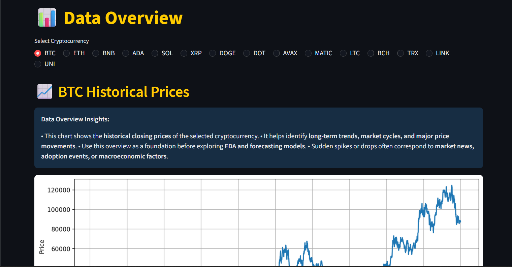
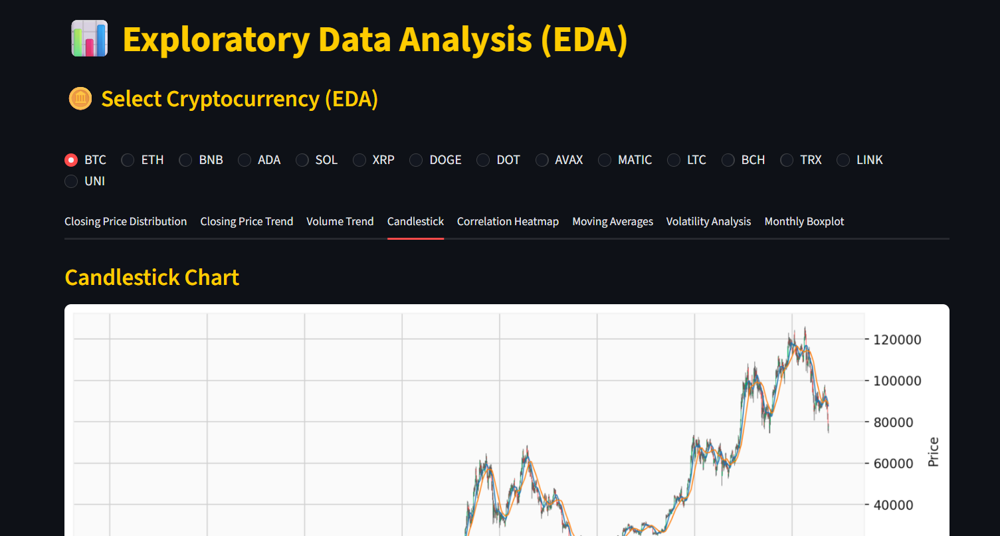
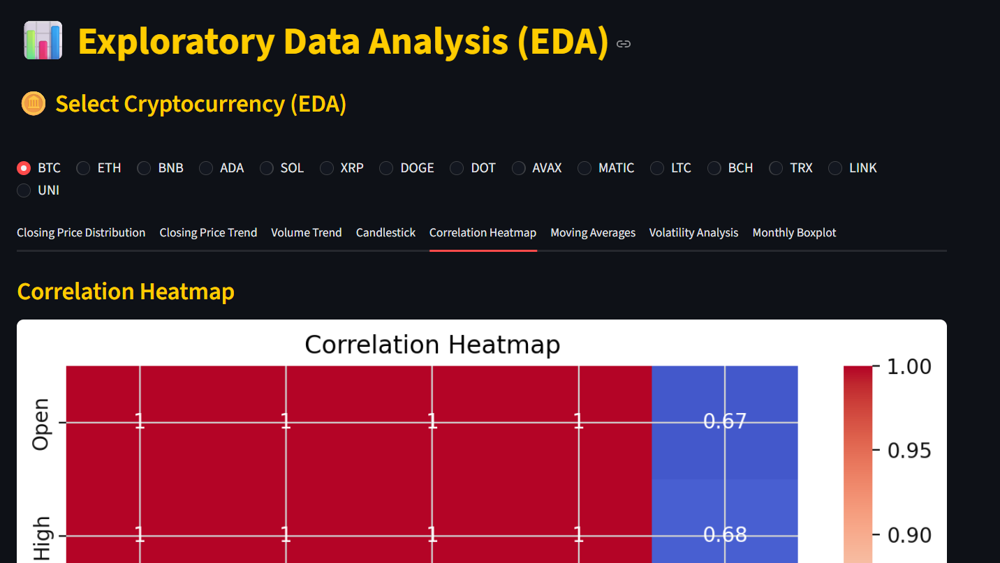
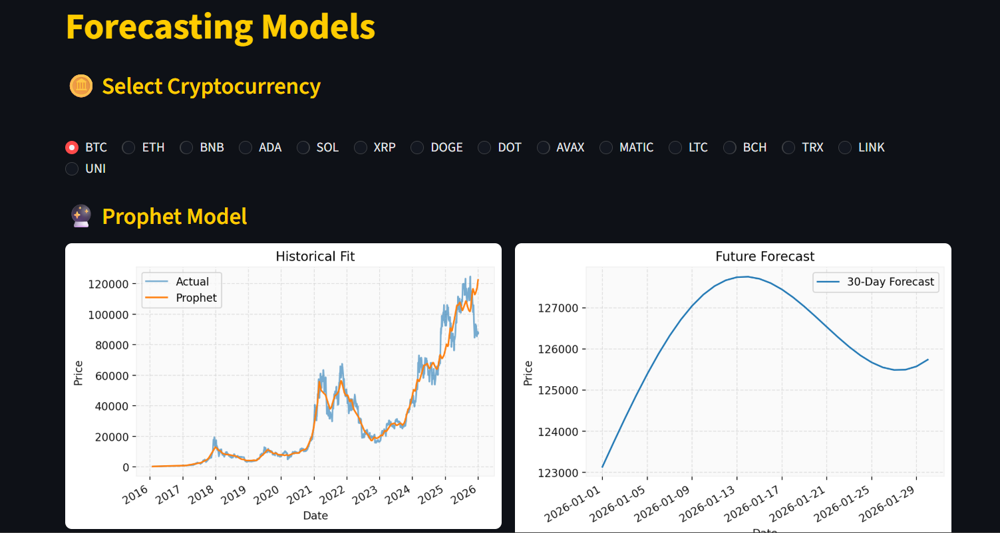
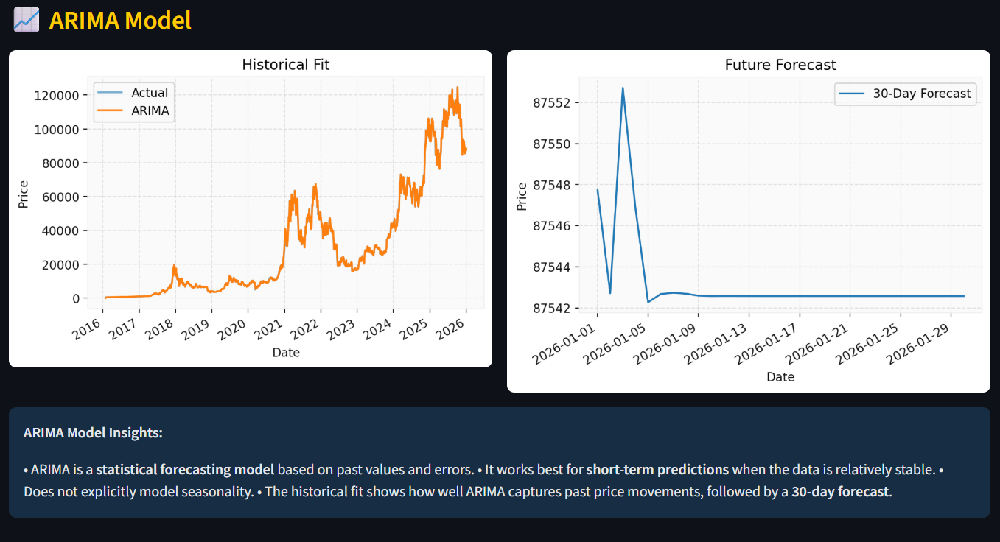
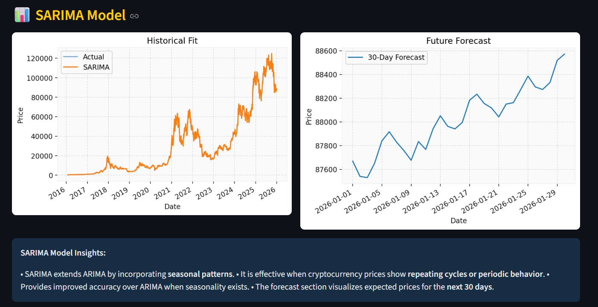
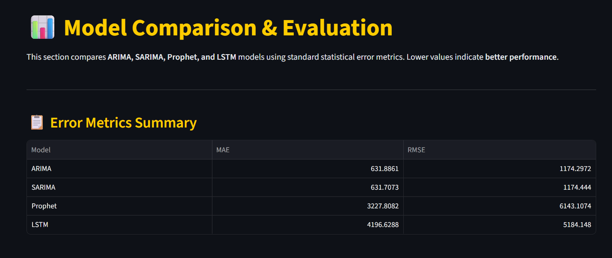

# 📈 Crypto Multi-Coin Forecasting Dashboard

An interactive **Streamlit-based cryptocurrency forecasting dashboard** that analyzes and predicts prices for multiple cryptocurrencies using **ARIMA, SARIMA, Prophet, and LSTM models**.

---

## 🚀 Features

- 📊 Historical price analysis for 15 cryptocurrencies
- 🔍 Advanced Exploratory Data Analysis (EDA)
- 🤖 Multiple forecasting models
- 📈 30-day future price prediction
- 📉 Model performance comparison (MAE, RMSE, R²)
- 🎨 Dark-themed interactive UI

---

## 🪙 Supported Cryptocurrencies

BTC, ETH, BNB, ADA, SOL, XRP, DOGE, DOT, AVAX, MATIC,  
LTC, BCH, TRX, LINK, UNI

---

## 🖥️ Application Screenshots

### 🏠 Home Page


---

### 📊 Data Overview



---

### 🔍 Exploratory Data Analysis (EDA)

#### Candlestick Chart



#### Correlation Heatmap



---

### 🔮 Forecasting Models

#### Prophet Model



#### ARIMA Model



#### SARIMA Model



#### LSTM Model


---

### 📉 Model Evaluation



---

## 🧠 Models Used

- **ARIMA** – Baseline statistical forecasting
- **SARIMA** – Seasonal time-series modeling
- **Prophet** – Long-term trend prediction
- **LSTM** – Deep learning-based sequence modeling

---

## ⚙️ Tech Stack

- Python
- Streamlit
- Pandas, NumPy
- Matplotlib, Seaborn, mplfinance
- Statsmodels
- TensorFlow / Keras

---

## ▶️ How to Run Locally

```bash
pip install -r requirements.txt
streamlit run app.py
